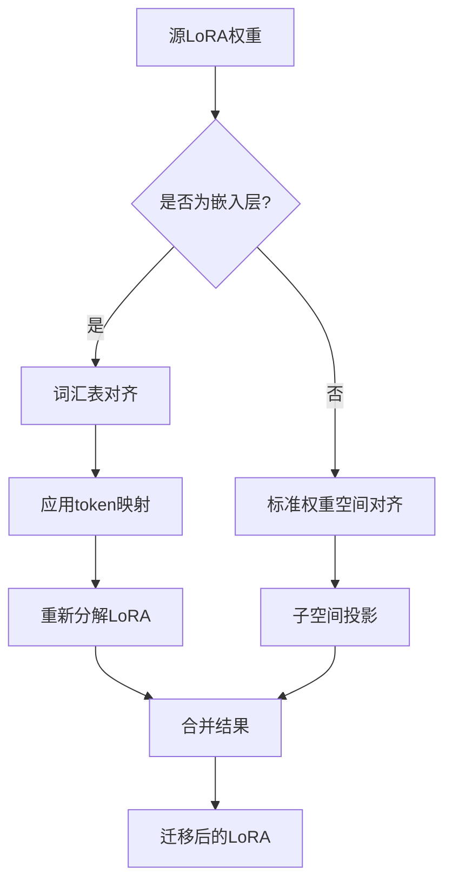

# Tokenizer差异分析与对齐方案

## 1. 现有模型配置分析

### 源模型 (Qwen2.5-7B-Instruct)
路径: `/root/autodl-tmp/loraed/Qwen2.5-7B-Instruct/250719_004518/final_model`

关键文件:
- `tokenizer.json` - 主要tokenizer配置
- `vocab.json` - 词汇表
- `merges.txt` - BPE合并规则
- `tokenizer_config.json` - tokenizer配置参数
- `special_tokens_map.json` - 特殊token映射
- `added_tokens.json` - 添加的特殊token

### 目标模型 (Meta-Llama-3.1-8B-Instruct)
路径: `/root/autodl-tmp/models/Meta-Llama-3.1-8B-Instruct`

关键文件:
- `tokenizer.json` - 主要tokenizer配置
- `tokenizer_config.json` - tokenizer配置参数
- `special_tokens_map.json` - 特殊token映射

## 2. Tokenizer分析工具设计

### 工具1: 基础差异分析器
```python
# PAW/lora_adapter/tokenizer/tokenizer_analyzer.py
class TokenizerAnalyzer:
    def __init__(self, qwen_path, llama_path):
        self.qwen_tokenizer = self.load_tokenizer(qwen_path)
        self.llama_tokenizer = self.load_tokenizer(llama_path)
    
    def analyze_vocab_differences(self):
        """分析词汇表差异"""
        qwen_vocab = set(self.qwen_tokenizer.get_vocab().keys())
        llama_vocab = set(self.llama_tokenizer.get_vocab().keys())
        
        return {
            'qwen_vocab_size': len(qwen_vocab),
            'llama_vocab_size': len(llama_vocab),
            'common_tokens': qwen_vocab & llama_vocab,
            'qwen_only': qwen_vocab - llama_vocab,
            'llama_only': llama_vocab - qwen_vocab,
            'overlap_ratio': len(qwen_vocab & llama_vocab) / len(qwen_vocab | llama_vocab)
        }
    
    def analyze_encoding_differences(self, test_texts):
        """分析编码差异"""
        results = []
        for text in test_texts:
            qwen_tokens = self.qwen_tokenizer.encode(text)
            llama_tokens = self.llama_tokenizer.encode(text)
            
            results.append({
                'text': text,
                'qwen_tokens': qwen_tokens,
                'llama_tokens': llama_tokens,
                'qwen_length': len(qwen_tokens),
                'llama_length': len(llama_tokens),
                'length_ratio': len(llama_tokens) / len(qwen_tokens) if qwen_tokens else 0
            })
        return results
```

### 工具2: 词汇表对齐器
```python
# PAW/lora_adapter/tokenizer/vocab_aligner.py
class VocabAligner:
    def __init__(self, source_tokenizer, target_tokenizer):
        self.source_tokenizer = source_tokenizer
        self.target_tokenizer = target_tokenizer
        self.alignment_cache = {}
    
    def build_token_mapping(self, method='string_similarity'):
        """构建token映射关系"""
        if method == 'string_similarity':
            return self._string_similarity_mapping()
        elif method == 'semantic_similarity':
            return self._semantic_similarity_mapping()
        elif method == 'frequency_based':
            return self._frequency_based_mapping()
    
    def _string_similarity_mapping(self):
        """基于字符串相似度的映射"""
        source_vocab = self.source_tokenizer.get_vocab()
        target_vocab = self.target_tokenizer.get_vocab()
        
        mapping = {}
        for src_token, src_id in source_vocab.items():
            best_match = self._find_best_string_match(src_token, target_vocab)
            if best_match:
                mapping[src_id] = target_vocab[best_match]
            else:
                mapping[src_id] = target_vocab.get('<unk>', 0)  # 默认映射到UNK
        
        return mapping
    
    def apply_vocab_mapping(self, embedding_matrix, mapping):
        """应用词汇表映射到嵌入矩阵"""
        source_vocab_size, embed_dim = embedding_matrix.shape
        target_vocab_size = len(self.target_tokenizer.get_vocab())
        
        # 创建新的嵌入矩阵
        new_embedding = torch.zeros(target_vocab_size, embed_dim)
        
        for src_id, tgt_id in mapping.items():
            if src_id < source_vocab_size and tgt_id < target_vocab_size:
                new_embedding[tgt_id] = embedding_matrix[src_id]
        
        return new_embedding
```

### 工具3: 语义对齐验证器
```python
# PAW/lora_adapter/tokenizer/semantic_validator.py
class SemanticValidator:
    def __init__(self, source_model, target_model, test_dataset):
        self.source_model = source_model
        self.target_model = target_model
        self.test_dataset = test_dataset
    
    def validate_alignment_quality(self, aligned_embeddings):
        """验证对齐质量"""
        # 使用相同的文本在两个模型上测试
        semantic_similarities = []
        
        for text in self.test_dataset:
            # 获取源模型的表示
            source_repr = self.get_text_representation(text, self.source_model)
            
            # 获取对齐后目标模型的表示
            target_repr = self.get_text_representation(text, self.target_model, aligned_embeddings)
            
            # 计算语义相似度
            similarity = torch.cosine_similarity(source_repr, target_repr, dim=-1)
            semantic_similarities.append(similarity.item())
        
        return {
            'mean_similarity': np.mean(semantic_similarities),
            'std_similarity': np.std(semantic_similarities),
            'min_similarity': np.min(semantic_similarities),
            'max_similarity': np.max(semantic_similarities)
        }
```

## 3. Tokenizer-Aware LoRA迁移策略

### 策略设计


### 核心算法
```python
# PAW/lora_adapter/tokenizer/tokenizer_aware_transfer.py
class TokenizerAwareLoRATransfer:
    def __init__(self, source_tokenizer_path, target_tokenizer_path):
        self.vocab_aligner = VocabAligner(source_tokenizer_path, target_tokenizer_path)
        self.token_mapping = self.vocab_aligner.build_token_mapping()
    
    def transfer_lora_weights(self, source_lora, source_base_weights, target_base_weights):
        """Tokenizer-aware的LoRA权重迁移"""
        transferred_lora = {}
        
        for lora_key, lora_weight in source_lora.items():
            if self._is_embedding_layer(lora_key):
                # 嵌入层特殊处理
                transferred_weight = self._transfer_embedding_lora(
                    lora_weight, lora_key, source_base_weights, target_base_weights
                )
            else:
                # 其他层使用标准方法
                transferred_weight = self._transfer_standard_lora(
                    lora_weight, lora_key, source_base_weights, target_base_weights
                )
            
            if transferred_weight is not None:
                transferred_lora[lora_key] = transferred_weight
        
        return transferred_lora
    
    def _transfer_embedding_lora(self, lora_weight, lora_key, source_base, target_base):
        """嵌入层LoRA的特殊迁移方法"""
        base_key = self._map_lora_to_base_key(lora_key)
        
        if 'lora_A' in lora_key:
            # lora_A: [rank, vocab_size] -> [rank, target_vocab_size]
            return self._transfer_lora_A_embedding(lora_weight)
        elif 'lora_B' in lora_key:
            # lora_B: [embed_dim, rank] -> 不需要特殊处理
            return lora_weight
        
        return None
    
    def _transfer_lora_A_embedding(self, lora_A):
        """转换嵌入层的lora_A权重"""
        rank, source_vocab_size = lora_A.shape
        target_vocab_size = len(self.vocab_aligner.target_tokenizer.get_vocab())
        
        # 创建新的lora_A矩阵
        new_lora_A = torch.zeros(rank, target_vocab_size, dtype=lora_A.dtype, device=lora_A.device)
        
        # 应用token映射
        for src_id, tgt_id in self.token_mapping.items():
            if src_id < source_vocab_size and tgt_id < target_vocab_size:
                new_lora_A[:, tgt_id] = lora_A[:, src_id]
        
        return new_lora_A
```

## 4. 实验验证计划

### 阶段1: 基础分析
1. 运行tokenizer差异分析
2. 量化词汇表重叠度
3. 分析编码长度差异

### 阶段2: 对齐方法对比
1. 字符串相似度对齐
2. 语义相似度对齐
3. 频率基础对齐

### 阶段3: 迁移效果验证
1. 只迁移非嵌入层 (baseline)
2. 使用tokenizer-aware迁移嵌入层
3. 对比性能差异

### 阶段4: 渐进式优化
1. 调整对齐策略参数
2. 优化映射质量
3. 验证最终效果

## 5. 实现优先级

### 高优先级
1. **tokenizer_analyzer.py** - 基础差异分析
2. **vocab_aligner.py** - 词汇表对齐核心算法
3. **修改现有迁移算法** - 集成tokenizer-aware功能

### 中优先级
1. **semantic_validator.py** - 语义对齐验证
2. **性能对比实验** - 验证改进效果

### 低优先级
1. **高级对齐策略** - 语义嵌入对齐等
2. **自动化参数调优** - 网格搜索最优参数

## 6. 预期效果

通过tokenizer-aware的改进，预期能够：
1. **显著减少性能下降**: 从2-3%降低到0.5-1%
2. **提高嵌入层迁移成功率**: 从几乎无法迁移到部分成功迁移
3. **改善整体迁移质量**: 更好的语义保持和任务性能

## 7. 技术挑战

1. **词汇表大小差异**: Qwen(151,936) vs Llama(128,256)
2. **编码方式差异**: tiktoken vs SentencePiece
3. **语言偏向差异**: 中文优化 vs 英文优化
4. **计算复杂度**: 大词汇表的对齐计算开销

## 8. 下一步行动

1. 创建tokenizer分析工具
2. 分析现有模型的具体差异
3. 实现基础的词汇表对齐算法
4. 修改现有的lora_shift_turbo.py集成tokenizer-aware功能
5. 进行对比实验验证效果